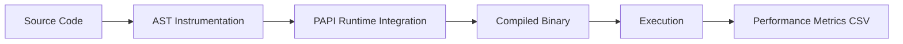

<div align="center">

# 🔬 LLVM-PAPI Function-Level Performance Instrumentation Tool

[](https://llvm.org/)
[](https://icl.utk.edu/papi/)
[](https://isocpp.org/)
[](LICENSE)

**A powerful compiler-based toolchain for automatically instrumenting C/C++ programs to collect per-function performance metrics**

[Features](#-features) • [Quick Start](#-quick-start) • [Usage](#-usage) • [Sample Output](#-sample-output) • [Documentation](#-documentation)

---

</div>

## 📖 Overview

This project leverages **LLVM Clang LibTooling** to automatically inject performance monitoring hooks into your C/C++ source code. It seamlessly integrates with **PAPI (Performance API)** to capture hardware performance counters at the function level, providing deep insights into your application's runtime behavior.

### 🎯 What It Does

- 🔍 **Automatic Instrumentation**: No manual code changes required
- ⚡ **Hardware Counter Access**: Track CPU cycles, cache misses, instructions executed, and more
- 📊 **Per-Function Analytics**: Granular performance data for every function
- 🚀 **Production Ready**: Fully automated pipeline with minimal overhead
- 📈 **CSV Export**: Easy-to-analyze performance reports

---

## ✨ Features

<table>
<tr>
<td width="50%">

### 🛠️ **Core Capabilities**

- ✅ Per-function entry/exit instrumentation using Clang AST rewriting
- ✅ Dynamic runtime integration with **PAPI** event counters
- ✅ Automated compilation and execution pipeline
- ✅ CLI-based customization for flexibility

</td>
<td width="50%">

### 📦 **Metrics Collected**

- 📝 Function name
- ⏱️ Start & end timestamps (nanosecond precision)
- 🔢 Configurable PAPI event values
- 💾 CSV-formatted output for easy analysis

</td>
</tr>
</table>

---

## 🚀 Quick Start

### Prerequisites

```bash
# Required dependencies
- LLVM/Clang (with LibTooling)
- PAPI library
- GCC/Clang compiler
```

### 🔧 Installation

```bash
# Clone the repository
git clone https://github.com/TarunB1006/PAPI-based-LLVM-Instrumentation-Tool.git
cd PAPI-based-LLVM-Instrumentation-Tool

# Make the pipeline executable
chmod +x run_pipeline.sh
```

---

## 💻 Usage

### Basic Command

```bash
./run_pipeline.sh \
  -i <input_file.c> \
  -e <event1,event2,...> \
  -o <output_file.csv>
```

### 📋 Command-Line Options

| Flag | Description | Required |
|------|-------------|----------|
| `-i` | Input C/C++ file to instrument | ✅ Yes |
| `-e` | Comma-separated PAPI events to monitor | ✅ Yes |
| `-o` | Output CSV file path | ⚠️ Optional |

### 🎯 Example Usage

```bash
# Monitor total instructions and L1 cache misses
./run_pipeline.sh \
  -i test/sample.c \
  -e "PAPI_TOT_INS,PAPI_L1_DCM" \
  -o performance_metrics.csv
```

### 🔄 Pipeline Process

When you run the script, it automatically:

1. 🔨 **Instruments** your source file with PAPI hooks
2. ⚙️ **Compiles** the instrumented code with PAPI runtime
3. ▶️ **Executes** the instrumented binary
4. 📊 **Collects** per-function metrics into CSV

---

## 🎪 Available PAPI Events

### 🔍 Discover Events

```bash
# List all available preset PAPI events
papi_avail

# Search for specific native hardware events
papi_native_avail | grep <keyword>
```

### 🔥 Popular Events

| Event | Description |
|-------|-------------|
| `PAPI_TOT_INS` | Total instructions executed |
| `PAPI_TOT_CYC` | Total CPU cycles |
| `PAPI_L1_DCM` | L1 data cache misses |
| `PAPI_L2_DCM` | L2 data cache misses |
| `PAPI_BR_MSP` | Branch mispredictions |
| `PAPI_FP_OPS` | Floating point operations |

---

## 📊 Sample Output

The tool generates a CSV file with detailed per-function metrics:

```csv
function_name,start_time,end_time,PAPI_TOT_INS,PAPI_L1_DCM
compute,1623651123.123456789,1623651123.456789123,10231,23
helper_function,1623651123.234567890,1623651123.345678901,5420,8
main,1623651123.457123456,1623651123.789321987,132,2
```

### 📈 Visualization Example

Use your favorite data analysis tools to visualize the results:
- 📊 Excel/Google Sheets for quick charts
- 🐍 Python (pandas, matplotlib) for advanced analysis
- 📉 R for statistical modeling

---

## 🏗️ Architecture



## Acknowledgments

- Built with **LLVM/Clang** LibTooling framework
- Performance monitoring powered by **PAPI** (Performance API)
- Inspired by the need for automated, low-overhead performance profiling
